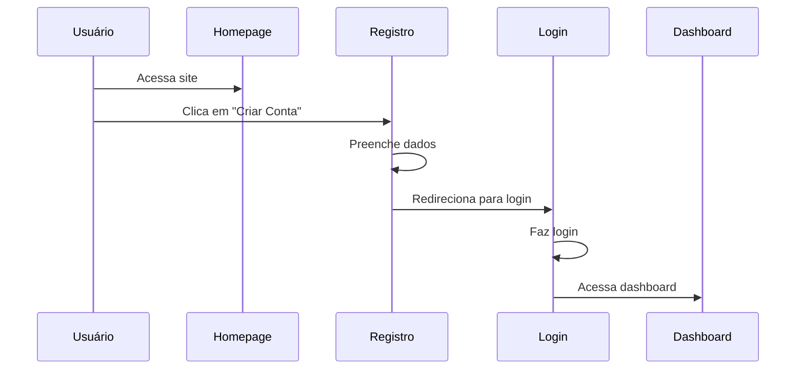
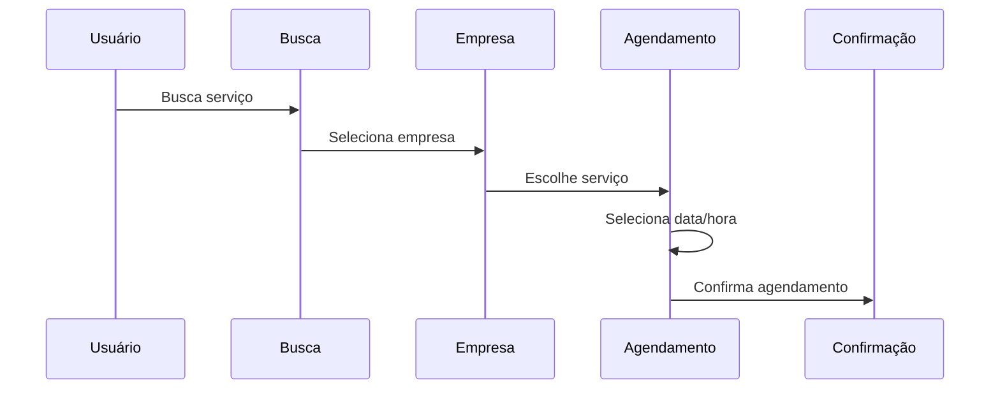
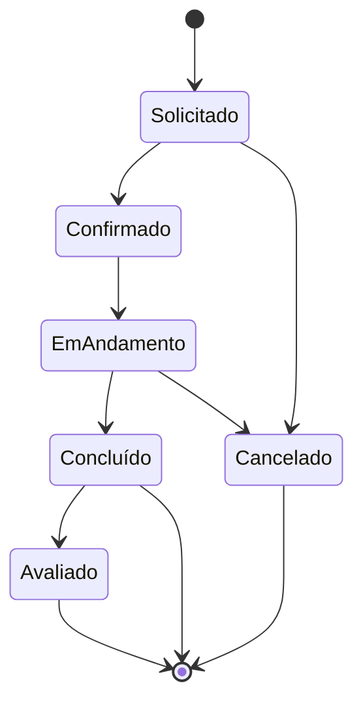
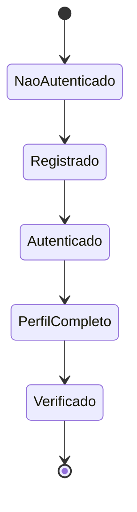
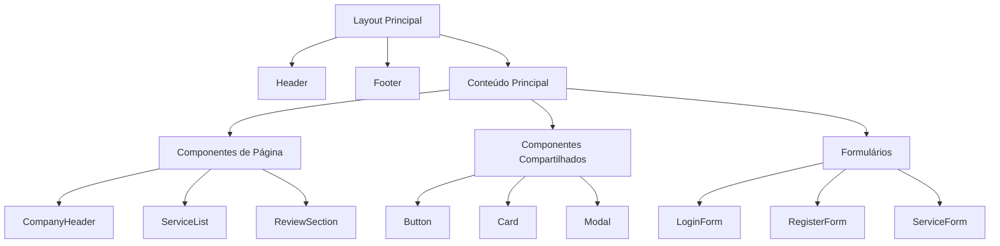
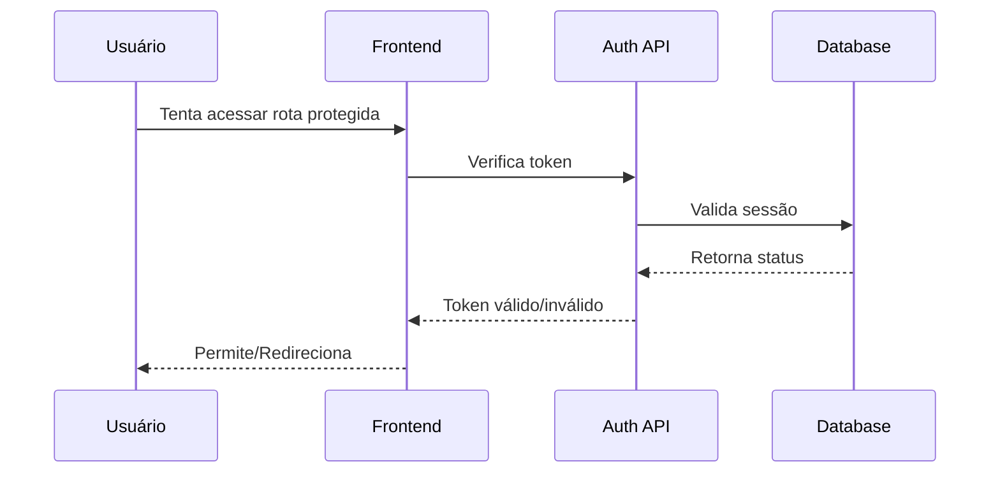

# Fluxograma do iServiços

## 🌐 Estrutura de Rotas

```mermaid
graph TD
    A[Homepage] --> B[Área Pública]
    A --> C[Área Autenticada]
    
    %% Área Pública
    B --> D[/servicos]
    B --> E[/empresas]
    B --> F[/profissionais]
    B --> G[/promocoes]
    
    %% Autenticação
    A --> H[/entrar]
    A --> I[/criar-conta]
    
    %% Área Autenticada
    C --> J[Área da Empresa]
    C --> K[Área do Cliente]
    C --> L[Área do Profissional]
    
    %% Detalhamento Empresa
    J --> M[/(empresa)/dashboard]
    J --> N[/(empresa)/servicos]
    J --> O[/(empresa)/agenda]
    J --> P[/(empresa)/promocoes]
    J --> Q[/(empresa)/configuracoes]
    
    %% Detalhamento Cliente
    K --> R[/(client)/perfil]
    K --> S[/(client)/agendamentos]
    K --> T[/(client)/favoritos]
    K --> U[/(client)/avaliacoes]
    
    %% Detalhamento Profissional
    L --> V[/profissional/dashboard]
    L --> W[/profissional/servicos]
    L --> X[/profissional/agenda]
    L --> Y[/profissional/avaliacoes]
```

## 📱 Fluxos Principais

### 1. Fluxo de Cadastro e Login



### 2. Fluxo de Busca e Agendamento



## 🗺️ Mapa do Site

### Área Pública
- **/**
  - Página inicial
  - Banner principal
  - Categorias em destaque
  - Serviços populares
  - Promoções ativas

- **/servicos**
  - Listagem de serviços
  - Filtros por categoria
  - Busca avançada
  - Ordenação por relevância/preço

- **/empresas**
  - Diretório de empresas
  - Filtros por localização
  - Avaliações e reviews
  - Categorias de serviço

- **/profissionais**
  - Lista de profissionais
  - Filtros por especialidade
  - Avaliações
  - Disponibilidade

- **/promocoes**
  - Ofertas ativas
  - Filtros por categoria
  - Ordenação por desconto
  - Validade das promoções

### Área da Empresa
- **/(empresa)/dashboard**
  - Visão geral
  - Métricas principais
  - Agendamentos do dia
  - Notificações

- **/(empresa)/servicos**
  - Cadastro de serviços
  - Gestão de preços
  - Disponibilidade
  - Categorização

- **/(empresa)/agenda**
  - Calendário de agendamentos
  - Gestão de horários
  - Confirmações
  - Histórico

- **/(empresa)/promocoes**
  - Criação de promoções
  - Gestão de descontos
  - Períodos de validade
  - Métricas de conversão

### Área do Cliente
- **/(client)/perfil**
  - Dados pessoais
  - Endereços
  - Preferências
  - Histórico

- **/(client)/agendamentos**
  - Agendamentos ativos
  - Histórico
  - Reagendamentos
  - Cancelamentos

- **/(client)/favoritos**
  - Empresas favoritas
  - Serviços salvos
  - Profissionais preferidos

### Área do Profissional
- **/profissional/dashboard**
  - Visão geral
  - Agenda do dia
  - Métricas de desempenho
  - Notificações

- **/profissional/servicos**
  - Serviços oferecidos
  - Precificação
  - Disponibilidade
  - Especialidades

## 🔄 Estados e Transições

### Estados de Agendamento


### Estados de Usuário


## 📊 Hierarquia de Componentes



## 🔐 Fluxo de Autenticação



## 📱 Responsividade

### Breakpoints
- Mobile: < 640px
- Tablet: 640px - 1024px
- Desktop: > 1024px

### Adaptações por Dispositivo
- **Mobile**
  - Menu hamburger
  - Cards em coluna única
  - Formulários simplificados

- **Tablet**
  - Menu expandido
  - Grid de 2 colunas
  - Sidebars colapsáveis

- **Desktop**
  - Menu completo
  - Grid de 3+ colunas
  - Layout expandido
